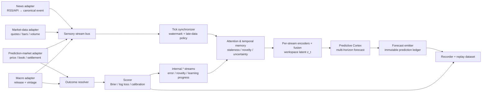
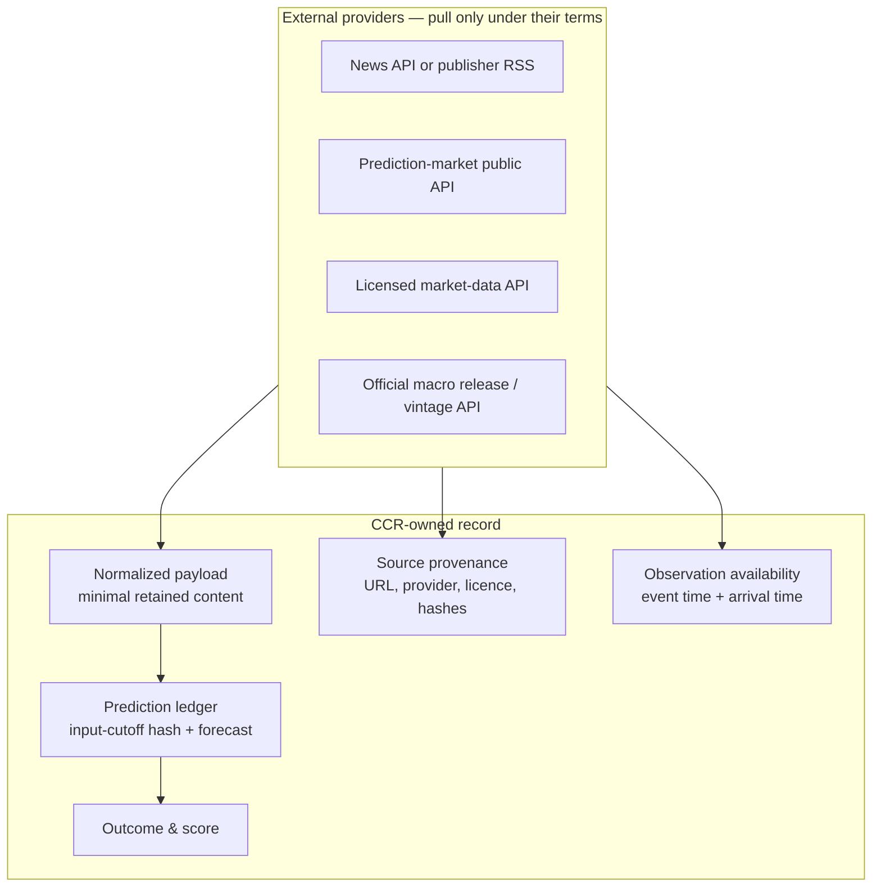

# Live Forecasting World — Architecture & Implementation Plan

> A paper-forecasting extension for the Predictive Cortex. External data becomes
> sensory streams, forecasts become recorded emissions, and later outcomes
> provide self-supervised targets. It is deliberately not a trading system.

## 1. Purpose and boundaries

The Forecasting World gives the organism a continuous, externally observable
environment in which it makes a forecast at time `t`, freezes it, and scores it
when a deadline arrives. It reuses the existing `Program` → streams → memory →
fusion → Cortex → record loop rather than building a second cognitive system.

The first questions must have a crisp, machine-checkable result:

- Will contract `X` resolve YES?
- Will contract `X`'s implied probability move beyond a fixed threshold before
  deadline `T`?
- Will a declared macro release be above a preset threshold?

Price-direction forecasting is a later benchmark. It is noisier and has to
compete with a market-price baseline. V1 must not place orders, use brokerage
credentials, or describe a score as proof of trading profitability.

### Design goals

1. Preserve the existing stream, memory, attention, Cortex, recorder, and replay
   contracts.
2. Retain provenance, publication time, ingestion time, revisions, and provider
   licence metadata for every external datum.
3. Make historical backtests and live paper runs identical at the stream and
   scoring boundary.
4. Use proper probabilistic scores and calibration, not directional accuracy.
5. Begin with a small prediction-market vertical slice; only then add news,
   macro, or price data.

### Non-goals for v1

- autonomous trading, investment advice, position sizing, or broker integration;
- retaining full article text unless its licence explicitly permits it;
- training on later-revised macro data;
- treating duplicated/syndicated articles as independent evidence.

## 2. Target architecture



The only new intelligence is domain-specific encoding and target construction.
The general mechanisms—stream validation, synchronization, memory, attention,
recurrent prediction, internal modulation, recording, and replay—remain the
existing CCR mechanisms.

### Data ownership and source boundary



The default news event retains a headline or permitted excerpt, URL, publisher,
timestamps, linked entities, and a derived embedding. A hash of the original
payload supports auditability without turning CCR into an unlicensed news
archive.

## 3. Stream catalog and contracts

The Forecasting World implements the current `Program` interface and publishes
standard `StreamEvent` values. It is compatible with the existing
`TickSynchronizer`, `TemporalBuffer`, `StreamRegistry`, recorder, and replay
format. Payloads are versioned JSON schemas.

| Stream id | Cadence | Classification | Minimal payload | Purpose |
|---|---:|---|---|---|
| `news.article` | event-driven | `agent_input` | source, URL, published/arrived times, entities, embedding reference | New public information |
| `market.quote.<venue>.<symbol>` | frequent | `agent_input` | bid, ask, last, volume, exchange time | Price/liquidity state |
| `market.bar.<symbol>.1m` | 1 minute | `agent_input` | OHLCV and interval | Stable low-frequency context |
| `prediction.market.<id>` | frequent | `agent_input` | implied probability, bid/ask, spread, volume, close time | Baseline probability/liquidity |
| `macro.release.<series>` | event-driven | `agent_input` | value, previous, release/vintage time | Dated measurable event |
| `outcome.resolved.<question>` | once | `aux_debug` | outcome, resolver, resolution time, evidence URL | Delayed label |
| `forecast.issued` | once per forecast | `aux_debug` | forecast ID, deadline, probability, cutoff hash | Immutable audit entry |
| `forecast.score` | once per resolution | `aux_debug` | Brier, log loss, calibration bin, baseline deltas | Learning diagnostic |

`source`, `provider_event_id`, schema version, event timestamp, and
`arrived_at` are mandatory on externally ingested streams. `timestamp` means the
time the data was observable to CCR, not merely when the underlying event
occurred. When they differ, retain both.

```python
@dataclass(frozen=True)
class ExternalObservation:
    observation_id: str          # provider + provider-native immutable ID
    stream_id: str
    observed_at: datetime        # publish/exchange/release time, UTC
    arrived_at: datetime         # time CCR received it, UTC
    payload: dict[str, Any]      # schema-versioned, minimally retained data
    source: str
    source_url: str | None
    content_hash: str
    license_tag: str
    revision_of: str | None
```

Corrections are new observations with `revision_of`; an adapter must never
rewrite a prior event. This preserves what was actually knowable at a cutoff.

## 4. Time, synchronization, and leakage controls

```mermaid
sequenceDiagram
    participant Feed as Provider feed
    participant Ingest as Adapter
    participant World as Forecasting World
    participant Cortex as Cortex
    participant Ledger as Prediction ledger
    participant Score as Outcome scorer

    Feed->>Ingest: article published at 10:00:02
    Ingest->>World: observed_at=10:00:02, arrived_at=10:00:04
    World->>Cortex: window closes at watermark 10:00:05
    Cortex->>Ledger: p(YES)=0.63, cutoff hash, deadline 18:00
    Note over Ledger: append-only; no mutation after issuance
    Feed->>Ingest: market settles at 18:00
    Ingest->>World: outcome.resolved YES
    World->>Score: pair only forecasts issued before 18:00
    Score->>Ledger: outcome, Brier/log-loss, baseline delta
```

The following policies are mandatory:

- Normalize all times to UTC, storing raw provider timestamp and clock source.
- Close a cognitive window only behind a configurable event-time watermark;
  late arrivals are recorded but cannot revise an issued forecast.
- Record an `input_cutoff_hash`: the digest of ordered event IDs/hashes, model
  checkpoint ID, and configuration hash available at issuance.
- In historical playback, expose an event only when
  `arrived_at <= simulated_now`. If arrival time is unknown, label the dataset
  *research-only* and make no latency claim.
- Use macro release/vintage data where available. Revisions publish new events.
- Deduplicate syndicated news by canonical URL/content hash; source duplicates
  remain provenance, not independent evidence.

## 5. Cortex task definition and evaluation

For a binary question `q` with deadline `d`, Cortex emits a probability
`p(q=YES | information available at t)`. The market's current implied
probability is both an input and the principal baseline. The delayed label is
unambiguous:

```text
target(q, t) = 1 if q resolves YES else 0
```

At issue time, Cortex emits:

1. `p_resolution`: probability the question resolves YES;
2. `p_move`: probability the market price moves beyond a defined threshold in a
   fixed horizon;
3. uncertainty for calibration, attention, and abstention.

The new probability head augments the existing multi-horizon latent heads; it
does not replace decoded sensory prediction. Candidate models must beat or match
simple chronological baselines:

| Target | Principal baseline | Required evaluation |
|---|---|---|
| Resolution | current market implied probability | log loss, Brier, calibration |
| Probability move | no-change/current probability | log loss, Brier, precision-recall |
| Macro threshold | release-history base rate | log loss, Brier, calibration |
| Price direction (later) | zero/market-adjusted return | out-of-sample loss only |

An improvement relative to the market is evidence of incremental forecasting
skill, not a trading strategy. Reports must include chronological folds,
confidence intervals, and results by question category—not just one global
average.

## 6. Required implementation changes

```text
cognitive_runtime/
  programs/
    forecasting/
      __init__.py
      program.py              # ForecastingProgram implements Program
      catalog.py              # stream specs and schemas
      clock.py                # live/simulated clock and watermarks
      models.py               # observations, questions, resolutions
      sources/
        base.py               # read-only adapter protocol
        news.py               # provider/RSS normalisation; no scraper engine
        market.py             # quotes/bars adapter
        prediction_market.py  # discovery, prices, books, resolution
        macro.py              # releases and vintages
      ledger.py               # append-only issuance + cutoff hashing
      resolver.py             # provider-backed resolution evidence
      scoring.py              # proper scores, calibration, baselines
  training/
    forecasting_dataset.py    # chronological windows + delayed labels
    forecasting_evaluation.py # walk-forward reports and confidence intervals
  tools/
    forecast_report.py        # inspect provenance, forecast, outcome, score
tests/
  test_forecasting_catalog.py
  test_forecasting_watermark.py
  test_forecast_ledger.py
  test_forecasting_dataset.py
  test_forecasting_evaluation.py
```

### Adapter seam

```python
class ForecastSource(Protocol):
    name: str

    def catalog(self) -> list[StreamSpec]: ...
    def poll(self, since: datetime | None) -> Iterable[ExternalObservation]: ...
    def health(self) -> SourceHealth: ...
```

`ForecastingProgram.step()` polls adapters, validates and normalizes their
observations, publishes deterministic event order, and advances the watermark.
Training/replay never make network calls; they read a recorded provider snapshot
or event log via the same seam.

### Forecast ledger seam

```python
@dataclass(frozen=True)
class ForecastRecord:
    forecast_id: str
    issued_at: datetime
    question_id: str
    deadline: datetime
    probability_yes: float
    uncertainty: float | None
    baseline_probability_yes: float | None
    checkpoint_id: str
    config_hash: str
    input_cutoff_hash: str
```

The ledger is append-only. Resolution and scoring are separate records keyed by
`forecast_id`; no forecast probability, deadline, model identity, or input
cutoff can be modified after issuance.

## 7. Delivery phases and gates

### F0 — contracts and deterministic playback

Add the observation envelope, catalog, source protocol, watermark clock, and a
fixture-backed `ForecastingProgram`. Fixtures contain ordered articles, quotes,
contract prices, and a resolution.

**Gate:** fixture replay has byte-stable event order and cutoff hashes. A late
event is recorded but does not alter a prior forecast.

### F1 — prediction-market paper forecast vertical slice

Implement one official prediction-market adapter, discovery, price history,
resolution retrieval, question normalisation, and ledger. Issue fixed-cadence
baseline forecasts before any learning.

**Gate:** a narrow allow-listed category can issue paper forecasts, recover after
restart without duplication, and score each eligible forecast with official
resolution evidence.

### F2 — proper scoring and evaluation harness

Implement Brier score, log loss, reliability tables/diagrams, coverage,
abstention accounting, and walk-forward data splits. Join each input window only
to outcomes occurring after its cutoff.

**Gate:** a deliberately leaky fixture and a model that copies current market
probability are both detected and reported correctly. The report includes
per-fold confidence intervals and baseline deltas.

### F3 — Cortex integration

Add forecasting encoders and a resolution-probability head. Begin with frozen
text embeddings or a compact permitted-text encoder, a small catalog, and the
GRU backbone. Reuse the multi-horizon world model and only widen its outputs.

**Gate:** on held-out, chronological prediction-market data, the Cortex is
calibrated and has no material degradation against the current-price baseline.
Promotion requires a pre-registered confidence-bound improvement in one
held-out category, replicated in a later fold.

### F4 — news and macro context

Add one licensed news/RSS source and one official macro/vintage source. Enable
entity linking, source-health streams, duplicate handling, and staleness-aware
attention.

**Gate:** a withheld-news ablation changes the model only through allowed
pre-deadline inputs, and revised macro data cannot appear before its revision
time in playback.

### F5 — observability and continuous learning

Add a report/clinic view for event timeline, freshness, attention allocation,
frozen forecasts, resolution evidence, calibration, and baseline comparisons.
Enable surprise-based replay priority only after the scoring pipeline passes.

**Gate:** an investigator can reconstruct any score's inputs, model checkpoint,
baseline, resolution evidence, and late-data status without a live provider.

## 8. Walkthrough: one forecast from news to score

1. An allow-listed news feed publishes an item. The adapter stores published and
   arrival times, deduplicates it, and emits `news.article` with permitted data.
2. Quote and prediction-market adapters publish on their own cadences. The
   synchronizer closes a cognitive window only when its watermark permits.
3. Attention sees a novel entity-linked article and active contract, assigns
   stream weights, and records why it did so.
4. Encoders and fusion turn the window/buffer into `z_t`. Cortex predicts future
   latent state, resolution probability, and uncertainty.
5. The emitter validates question/deadline/baseline and appends a
   `ForecastRecord` plus `forecast.issued`. The cutoff hash binds the forecast to
   exactly what was seen.
6. A later headline, correction, or macro revision cannot mutate the forecast;
   it is separately retained for future research.
7. When the question resolves, the resolver appends evidence. The scorer joins
   only pre-deadline forecasts, calculates scores and baseline deltas, and emits
   `forecast.score`.
8. Surprise and calibration become `internal.*` diagnostics and, only after
   validation, replay-priority signals. Training remains chronological.

## 9. Operations and governance

- Source keys come from environment variables or a local secret store; neither
  recorder output nor checkpoints contain raw credentials.
- Source configuration carries terms URL, rate limit, retention policy, and
  `license_tag`. Fail closed when required provenance is absent.
- Publish source health, lag, last success, deduplication, and dropped-event
  metrics as `aux_debug` streams. A stale source causes abstention or an
  explicitly flagged forecast—not silent confidence.
- No source adapter contains trading credentials and no motor action maps to an
  order. The only v1 emission is a forecast record.

## 10. First implementation slice

Build F0 and F1 with one official prediction-market provider and five to twenty
manually allow-listed binary questions. Do not add news, text training, stocks,
or a learned policy yet. This validates the difficult pieces: external event
time, immutable issuance, delayed resolution, restart deduplication, and honest
scoring against market-implied probability.

Only then should news and macro data enter as candidate evidence whose
incremental value is measured by ablation, rather than as a larger data pile that
makes a backtest easier to overfit.
