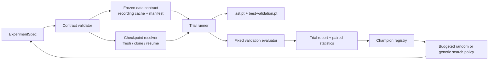

# Proposal — Model Factory: Reproducible Checkpoint Lineage and Budgeted Experiments

> **Status:** design proposal. This extends the Predictive Cortex training
> workflow described in [phase 2](phases/phase-2-predictive-cortex.md) and
> complements the project-wide checkpoint contract in
> [contracts and data flow](04-contracts-and-data-flow.md). It does not alter
> the organism-development promotion ladder.

## 1. Decision

Add a **Model Factory** for the action-conditioned Predictive Cortex. The
factory creates immutable experiment runs, records model and data provenance,
clones compatible checkpoints, runs controlled A/B trials, and promotes a
champion only from fixed validation evidence.

The first implementation is deliberately modest:

1. explicit experiment specifications and immutable artifacts;
2. complete, resumable training checkpoints;
3. controlled fresh/clone/fine-tune trials;
4. paired validation comparison and a champion registry;
5. budgeted random search and bounded genetic configuration search.

Bayesian optimization, automated architecture search, and unconstrained
architecture/data mutation are explicitly deferred. They become useful only
after the factory has collected a sufficiently large set of comparable trials.

## 2. Problem

The notebook can record data, train the cortex, save a full model, evaluate it,
and write an experiment report. Those are strong primitives, but they leave
important experimental questions to manual convention:

- Was this model initialized fresh, loaded from a checkpoint, or merely saved
  beside an earlier checkpoint?
- Which parent checkpoint and exact configuration produced this result?
- Did two candidates consume exactly the same recordings and validation seeds?
- Which field changed in an A/B comparison?
- Is a lower score across a few seeds a reliable regression or promotion?
- Which checkpoint is the current champion for a stated objective?

The result is easy-to-run but difficult-to-compare experimentation. A model
factory should improve experimental discipline; it must not pretend to infer
scientific conclusions from training loss alone.

## 3. Goals and non-goals

### Goals

- Make fresh, cloned, resumed, and fine-tuned trials explicit and auditable.
- Reject unsafe checkpoint continuation before weights are loaded.
- Freeze the recorded-data and validation contracts for an A/B trial.
- Persist the information required for exact resume: weights, optimizer,
  scheduler, RNG state, epoch, and effective configuration.
- Select and retain a champion by a declared validation metric and gates.
- Support small, budgeted parameter sweeps without changing source notebooks.
- Reuse the existing `RunTrace`, nursery cache, checkpoint, and experiment
  report infrastructure where possible.

### Non-goals

- Replace the development ladder or its stage-promotion semantics.
- Treat repeated validation selection as final evidence of generalization.
- Automatically search all architecture, data, and loss dimensions together.
- Introduce a distributed scheduler, database service, or external tuning
  dependency in the first release.
- Change the scientific definition of copy-last, rollout health, or current
  cortex evaluation metrics.

## 4. Core terminology

| Term | Meaning |
| --- | --- |
| **Run** | One immutable execution with its own `run_id`, trace, artifacts, and result. |
| **Checkpoint** | A serializable model and optional resumable optimizer/trainer state. |
| **Parent** | The exact checkpoint SHA from which a clone or fine-tune begins. |
| **Fresh trial** | A trial with no parent checkpoint. |
| **Clone trial** | A child initialized from the same parent as one or more siblings. |
| **Resume** | Continue the exact optimizer/RNG trajectory of an interrupted run. |
| **Fine-tune** | Continue model weights with a new training contract; a new optimizer trajectory is allowed but must be stated. |
| **Candidate** | A completed trial eligible for comparison. |
| **Champion** | The promoted checkpoint for a named objective, not merely the most recently trained model. |
| **Champion population** | A bounded, diverse set of promoted checkpoints retained for one stage, tier, and objective. |
| **Genome** | The canonical, bounded set of tunable configuration genes used to propose an offspring trial. |
| **Data contract** | Exact recordings, preprocessing, train/validation/test partition, and evaluation protocol. |

## 5. Three identities

The factory must keep three identities separate.

```text
run_id                  Human-facing immutable artifact identity
architecture_hash       Checkpoint compatibility identity
data_contract_hash      Meaning of the training/evaluation evidence
training_contract_hash  Optimization procedure identity
parent_checkpoint_sha   Lineage edge
environment_hash        Source and runtime identity needed to reproduce execution
```

`experiment_id` is therefore a run identifier, not a model architecture
identifier and not a claim that a checkpoint was resumed.

### 5.1 Architecture compatibility identity

The following fields must match for a strict resume or a direct checkpoint
clone. A difference creates a fresh architecture branch.

- pixel shape and RGB preprocessing version;
- ordered action vocabulary;
- workspace modalities and workspace layout hash;
- latent width, hidden width, and action embedding width;
- reconstruction shape and visual architecture;
- semantic-class count;
- tick horizons and direct-horizon-head topology;
- backbone name, context capacity, and all backbone-specific kwargs.

The factory computes `architecture_hash` from a canonical JSON representation
of these values. The hash is stored in both the checkpoint and trial manifest.

### 5.2 Data contract identity

The data contract includes:

- world, backend, program configuration, scenario names, and scenario code
  version;
- exact train, validation, and test session identifiers and content hashes;
- train/validation/test seed assignments;
- pixel provenance, semantic-vocabulary version, and preprocessing version;
- horizons expressed in ticks and their recording-rate conversion;
- data-quality and split-overlap policy.

Changing training scenarios can be a valid fine-tune, but it is not the same
evidence as the parent. A changed validation or test contract cannot support a
direct champion comparison.

### 5.3 Training contract identity

The training contract records all non-topological choices:

- objective, epochs or step budget, optimizer, scheduler, batch size, and seed;
- stage-specific maximum training time and checkpoint cadence;
- rollout/warmup schedule and scheduled-sampling probability;
- all active loss weights and target-encoder settings;
- transition-balancing policy;
- early stopping and checkpoint-selection policy;
- device/precision/determinism settings.

Training-contract changes are the normal controlled A/B dimensions. They
always create a new run and may create a fine-tuned child from a compatible
parent.

### 5.4 Execution environment identity

Every run records the source commit and dirty-tree status, package-lock or
environment hash, Python/PyTorch/CUDA versions, device, precision, and
determinism policy. Exact bitwise replay is promised only for declared
deterministic environments; otherwise this record makes differences
diagnosable rather than invisible.

### 5.5 Human-readable lineage name

Each run also receives a cosmetic `display_name` from the existing
`namesgenerator` dependency. It improves browsing only: `run_id`, hashes, and
checkpoint SHA remain the authoritative identities, and naming never seeds
training or affects promotion.

A fresh model uses the generator's two-part name, such as
`vigorous-shannon`. A one-parent clone or fine-tune receives a new generated
first part and retains its parent's surname sequence. A two-parent genetic
child receives a new generated first part plus two hyphenated surnames:

```text
parent A: brave-shannon-curie     -> first surname:  shannon
parent B: calm-turing-lovelace    -> second surname: lovelace
child:    eager-shannon-lovelace
```

The factory uses a stored naming seed to choose the generated first part and
the order of configuration parents. If a parent has only one surname, that
surname supplies either requested position. A display-name collision is
disambiguated with a short `run_id` suffix; the assigned name is never later
renamed.

## 6. Architecture



### 6.1 Proposed modules

```text
cognitive_runtime/training/model_factory/
  __init__.py
  spec.py          # immutable specs, canonicalization, validation
  contracts.py     # architecture/data/training contract hashes
  checkpoint.py    # resumable cortex checkpoint payload and compatibility checks
  runner.py        # fresh, clone, resume, fine-tune trial execution
  evaluator.py     # validation/test evaluation and paired comparison
  registry.py      # JSON-backed champion and lineage registry
  search.py        # random and successive-halving trial proposal
```

The runner calls the existing `run_nursery_joint`,
`train_action_world_model`, `evaluate_action_world_model_milestone`,
`RunTrace`, and experiment-report functions. It should not duplicate model
training or metrics.

## 7. Artifact layout

Each run receives a unique ID and never overwrites another run.

```text
runs/Crafter/<run_id>/
  experiment.json              # existing human identity manifest
  trial_spec.json              # immutable resolved ExperimentSpec
  display_name.json            # cosmetic name, naming seed, and surname sources
  contracts.json               # hashes plus canonical contract payloads
  lineage.json                 # parent run/checkpoint, mode, sibling group
  data_manifest.json           # exact cached/session artifact hashes
  execution.json               # source, package, device, and timing provenance
  checkpoints/
    last.pt
    best-validation.pt
  metrics/
    validation.json
    test.json                  # only written by an explicit final-test action
    comparison.json
  experiment_report.json
  trace.jsonl                  # or pointer to the standard trace directory
```

`registry.json` lives under `runs/Crafter/` and contains only references,
never copied model weights. It records both a designated leading champion and
the retained champion population for each stage/tier/objective. A
single-process JSON registry is sufficient for the first release. If concurrent
writers are later required, replace it with SQLite while preserving the public
schema.

### 7.1 Frozen episode corpora

Episode generation is a separate factory operation from model training. It
creates an immutable, quality-gated **corpus** before any A/B trial begins:

```text
corpora/Crafter/<corpus_id>/
  corpus_spec.json             # generator, seeds, scenarios, and split policy
  corpus_manifest.json         # session paths, content hashes, and label versions
  quality_report.json
  split_overlap_report.json
  train_sessions.json
  validation_sessions.json
  test_sessions.json
```

The corpus builder may populate or reuse the nursery episode cache, but it
must resolve every required episode and then freeze the resulting session
hashes into `corpus_manifest.json`. A factory trial references `corpus_id` and
does not record episodes.

This makes a trial's measured work model building and evaluation, not simulator
recording. It also makes an A/B comparison fair: sibling trials consume the
same frames, actions, labels, and train/validation/test sessions.

For a controlled clone or search trial, a missing cache entry is an error, not
permission to record a replacement episode. Creating or changing a corpus
requires a new `corpus_id`, runs quality and split-overlap gates again, and
creates a new data-contract hash.

## 8. Experiment specification

The on-disk JSON is canonical; YAML is optional input convenience.

```yaml
format: model-factory-spec-v1
# run_id is assigned by the factory at launch; templates do not reuse it.
# display_name and naming metadata are assigned at the same time.
organism: Crafter
mode: fine_tune             # fresh | clone | resume | fine_tune
parent:
  run_id: crafter-rollout-0003
  checkpoint: best-validation.pt
  sha256: "..."
data:
  corpus_id: crafter-generic-action-effects-v1
  world: crafter
  train_scenarios: [approach_entity]
  train_sessions: ["cache:..."]
  validation_sessions: ["cache:..."]
  test_sessions: ["cache:..."]
  expected_pixel_source: crafter
  horizons_ticks: [1, 2, 3, 4]
model:
  backbone: transformer
  latent_width: 128
  hidden_dim: 256
  action_embed_dim: 8
  reconstruction_size: 64
  context_length: 8
  backbone_kwargs: {n_heads: 2, n_layers: 1}
training:
  objective: windowed_rollout
  budget: {epochs: 50}
  runtime_budget: {stage: fast, max_training_seconds: 600}
  optimizer: {name: adamw, lr: 0.0003, weight_decay: 0.00001}
  scheduled_sampling_p: 0.25
  closed_loop_pixel_loss_weight: 0.25
evaluation:
  selection_metric: rollout.t+4.model_over_copy_last_mse
  gates: [rollout_health, representation_collapse]
  confidence: 0.95
evolution:
  generation: 3
  configuration_parents: [crafter-rollout-0018, crafter-rollout-0021]
  weight_donor: crafter-rollout-0021
  genome_operator: uniform_crossover_v1
  mutations: [training.optimizer.lr]
```

The resolver writes the fully expanded configuration, including defaults. A
trial must never be reproducible only from a notebook cell and its current
defaults.

## 9. Checkpoint contract

The current `action-world-model-v2` checkpoint stores model state and some
metadata. The factory adds a versioned resumable payload:

```text
format: action-world-model-factory-v1
model_state_dict
optimizer_state_dict
scheduler_state_dict | null
trainer_state: {epoch, global_step, best_validation_metric}
rng_state: {python, numpy, torch_cpu, torch_cuda}
architecture_contract
data_contract_hash
training_contract
parent_checkpoint_sha | null
training_stats
```

There are two deliberately different load modes:

1. **resume** requires identical architecture, data, and training contracts,
   then restores optimizer and RNG state;
2. **clone/fine_tune** requires identical architecture and compatible input
   contract, restores model weights, and records a new training contract.

`backbone_kwargs`, `action_embed_dim`, all resolved visual settings, and the
complete optimizer definition must be persisted. They are not all preserved
by the current checkpoint format.

## 10. Evaluation protocol and promotion

### 10.1 Split discipline

The factory uses three sets:

- **train:** model fitting;
- **validation:** A/B comparison, early stopping, and champion selection;
- **test:** final confirmation only, never queried during routine search.

Existing notebook “holdout” seeds become factory validation seeds once they
are repeatedly used to choose settings. Test seeds must be separate and
sealed in the trial specification.

### 10.2 Paired comparison

Candidate and baseline predict the same validation episodes. Compare the
per-episode difference in the declared primary metric, for example:

```text
delta_i = candidate_rollout_t4_mse_i - champion_rollout_t4_mse_i
```

Report mean delta, confidence interval, win rate, and episode count. Prefer a
paired bootstrap or paired permutation interval over independent confidence
interval overlap. With a small number of seeds, this has materially more
power and makes the matched evaluation explicit.

The factory also distinguishes **evaluation seeds** from **training seeds**.
Paired episodes reduce evaluation noise; they do not establish that one lucky
optimization trajectory is superior. A durable promotion reruns the leading
configuration on a small declared set of independent training seeds and
compares the resulting aggregate, while ordinary fast search may use one seed.

### 10.3 Promotion rule

A candidate is promoted only when all are true:

1. data-quality and split-overlap gates pass;
2. representation and rollout-health gates pass;
3. its primary validation metric improves over the champion by a configured
   minimum practical margin and passes the paired-comparison rule;
4. it does not regress configured safety metrics beyond their allowed margin;
5. it completes within the stage's declared training-time budget; and
6. its raw and stratified metrics pass their versioned metric schema (the
   copy-last ratio is never used without its raw errors); and
7. a final test action confirms the selected candidate when it is intended to
   become a durable champion.

Training loss is recorded for diagnostics but is never a promotion metric.
Test actions are recorded against a small explicit test-use budget; routine
search and population updates never query the sealed split.

## 11. Controlled experiment modes

| Mode | Parent requirements | Intended use |
| --- | --- | --- |
| `fresh` | None | Establish a baseline or test a new architecture/data contract. |
| `clone` | Same architecture and data contract | Short A/B of training-only parameters. |
| `resume` | Exact architecture, data, and training contract | Recover from interruption. |
| `fine_tune` | Same architecture and compatible input contract | Additional data or changed training schedule. |

Every mode creates a new `run_id`; only `resume` may append to an interrupted
run after validating its existing immutable specification.

## 12. Primary generic-training and navigation curriculum

The factory's default Cortex data suite is a **generic action-effects
curriculum**. It is the main source of data for building a reusable world
model; it does not replace the existing narrow nursery scenarios.

### 12.1 Separate the world model from the pathfinder

Random action bursts teach a world model the conditional dynamics question:

```text
given local world state and action, what changes next?
```

They do not teach pathfinding by themselves because they contain neither a
goal nor an optimal-route signal. Goal-directed navigation is therefore a
separate, later policy/planning curriculum that consumes the learned model and
a goal representation.

The factory maintains distinct benchmark families and champions:

| Family | Purpose | Promotion evidence |
| --- | --- | --- |
| `generic_action_effects_v1` | General action-conditioned world dynamics | One/multi-step prediction, action-effect and local-grid metrics, rollout health |
| `goal_navigation_v1` | Goal-conditioned choice and replanning | Success rate, geodesic efficiency, collision rate, replan recovery |

A navigation-policy score must not conceal poor world dynamics, and a
world-model promotion must not claim that the model is already a pathfinder.
When a generic champion is fine-tuned for navigation, it is evaluated on the
generic retention suite as well as navigation. The target-stage contract
declares any replay mixture and the allowed retention regression; forgetting
is therefore a promotion failure, not an after-the-fact surprise.

### 12.2 Default generic-training suite

The preferred initial mix is:

```text
generic_action_effects_v1
  60% motor_babbling_open
  30% motor_babbling_walls
  10% focused canaries
       walk_forward_short
       blocked_forward
       turn
       approach_entity
```

The percentages are a starting data-collection policy, not a fixed scientific
constant. The resolved scenario weights, episode counts, and every generator
parameter are part of the `DataContract`; they must be identical for a
controlled A/B trial.

`motor_babbling_open` samples only `MOVE_UP`, `MOVE_DOWN`, `MOVE_LEFT`,
`MOVE_RIGHT`, and `NULL`. It chooses actions uniformly and holds each sampled
action for 1--4 ticks. It varies seeds, starting facing, terrain, and local
map context while retaining enough clear space to provide a healthy mix of
movement outcomes.

`motor_babbling_walls` uses the same action-burst policy, but randomizes
nearby wall placement and local corridors. Its generator must guarantee and
report a usable mix of free movement, blocked movement, turns, and recovery;
it must not silently degrade into long stationary tails.

The existing focused scenarios remain canaries. They retain their specialized
quality gates and allow regressions in collision handling, turns, scale change,
and entity interaction to be found even when a broad action-burst average is
healthy.

### 12.3 Action-effect labels and metrics

Every generic action-effects episode records or deterministically derives:

- position delta and movement magnitude;
- facing delta;
- blocked/contact indicator;
- local semantic-grid delta;
- action-effect class: `moved`, `turned_only`, `blocked`, `interacted`, or
  `no_op`.

Crafter already records position, discrete facing, local semantic grids, and
actions, so the first increment is to derive and report these labels. The
factory should use them for event-stratified evaluation before adding new model
heads.

Explicit action-effect prediction heads are a subsequent architecture branch,
not an untracked change to the generic Cortex. If introduced, their output
schema and loss weights are part of the architecture and training contracts,
respectively.

### 12.4 Goal-conditioned navigation schedule

After the generic suite is healthy, add navigation stages in order:

```text
1. navigate_open_goal       direct movement to a caregiver-set coordinate
2. navigate_single_wall     one required detour
3. navigate_two_wall        held-out layouts and longer routes
4. replan_after_block       a route changes after movement begins
```

The navigation policy receives a goal representation such as:

```text
internal.goal.relative_position = [dx, dy]
internal.goal.distance
internal.goal.active
internal.goal.source = caregiver | organism
```

The initial source is always `caregiver`. The organism may later propose goals,
but it must not receive a completion reward for choosing its current position:
require a minimum initial distance, a goal-commitment horizon, and externally
evaluated arrival.

The simulator may use its complete map and offline A* to write the following
**training-only labels**:

- shortest-path/geodesic distance;
- next optimal action and legal-action mask;
- path-progress delta;
- route invalidation and replan-required labels.

These oracle labels must never enter the deployed sensory workspace. The policy
uses local observations plus the relative goal, not the simulator's full map or
the oracle's next action.

### 12.5 Rewards and behavior mixture

For empty maps or corridors, begin with Manhattan distance. Once walls matter,
the shaping signal must use shortest-path/geodesic distance; Cartesian distance
would punish a correct detour that temporarily moves away from the goal.

Use potential-based progress reward with a one-time arrival bonus, rather than
paying the agent every tick for remaining near a target:

```text
Phi(s) = -strength * geodesic_distance(s, goal)
reward.goal_progress = gamma * Phi(s_next) - Phi(s)
reward.goal_reached  = success_bonus, once inside goal_radius
```

Keep goal progress, completion, collision, and task reward separate in the
recording and report. A linear potential is the initial default. Saturating
falloff potentials are an optional later data-contract parameter; they reduce
the reward gradient far from the goal and should not replace the simple baseline
without a controlled comparison.

For expert navigation data, use 70--80% A*-selected actions and inject random
cardinal actions on 20--30% of steps. The injected actions create recovery and
replanning examples absent from expert-only trajectories. Reduce the injection
rate only after held-out navigation success and recovery metrics improve.

### 12.6 Factory contract additions

For these suites, `DataContract` additionally includes:

- scenario-generator name and version;
- action subset, action-burst distribution, and fixed generator seed;
- wall/layout distribution, start/goal distribution, and solvability checks;
- action-effect label schema and semantic-vocabulary version;
- oracle-planner version and its map-cost assumptions;
- reward potential, strength, falloff, discount, success radius, and bonus;
- expert/random injection schedule; and
- role of each split: generic training, navigation training, validation, or
  sealed test.

Any change in those fields is a changed data or training contract. It cannot be
reported as a pure loss-weight or optimizer improvement.

## 13. Search policy

### 13.1 Initial search

Use fixed-parent, small random or Latin-hypercube samples over a narrow,
declared search space. For example, vary only:

```text
learning rate
scheduled sampling probability
closed-loop pixel loss weight
closed-loop latent loss weight
```

Do not jointly vary architecture, data split, objective, and loss weights.

### 13.2 Successive halving

Use checkpoint budgets such as 50, 150, and 500 epochs:

1. train 4–8 siblings for the first budget;
2. evaluate fixed validation episodes;
3. retain the best half using the declared primary metric and safety gates;
4. continue surviving checkpoints to the next budget;
5. compare the final survivor to the champion.

Periodic checkpoints are a prerequisite. The factory must not simulate this
by retraining each candidate from scratch.

### 13.3 Deferred surrogate optimization

Bayesian or learned-parameter optimization is deferred until at least roughly
20 comparable completed trials exist in one stable search space. Until then,
the surrogate would mostly learn noise and accidental differences in data or
budget rather than useful parameter response.

## 14. Genetic configuration exploration and champion populations

The factory supports a bounded genetic algorithm for proposing configurations
and retaining useful lineages. Its purpose is to explore combinations of
training settings that a one-knob A/B sweep would miss, while preserving the
data, budget, and evaluation discipline above.

### 14.1 Scope: evolve configurations before weights

An initial offspring has two configuration parents but exactly one explicit
weight donor:

```text
parent A config  --\
                    -> validated offspring configuration -> train from donor weights
parent B config  --/                                    -> new child checkpoint
```

The offspring genome uses recombination and bounded mutation over declared
tunable fields. It does **not** average or splice parent neural weights. Neural
weight arithmetic is unsafe by default because independently trained networks
can occupy different parameter symmetries even when their architectures match.
Weight interpolation or model soups are a separate future experiment requiring
their own validation protocol.

For the initial implementation, both parents must share the same architecture
hash, corpus, stage, budget tier, and evaluation contract. The child inherits
one parent's checkpoint as `weight_donor`; the other parent contributes only
configuration genes. If an offspring changes an architecture field, it becomes
a fresh architecture branch and cannot be called a normal genetic fine-tune.

At a stage transition, select parents from one compatible source-stage
population, record that source contract in lineage, and evaluate every child on
the new target corpus. The new corpus makes the child a fine-tune branch, not a
within-stage A/B comparison.

### 14.2 Genome schema and operators

The factory declares a versioned genome schema per stage. A generic
action-effects schema may include only bounded training genes such as:

```text
optimizer.lr                         log-uniform range
optimizer.weight_decay               bounded range
scheduled_sampling_p                 [0.0, 0.5]
closed_loop_pixel_loss_weight        bounded range
closed_loop_latent_loss_weight       bounded range
rollout_frames                       allowed integers
warmup_frames                        allowed integers subject to rollout validity
transition_balance parameters        bounded range
```

Each gene declares a type, range or choices, default, mutation distribution,
and conditional validity rules. Examples: a windowed-only loss gene is inactive
under the autoregressive objective; `warmup_frames + rollout_frames` must fit
the minimum episode length; a configuration that exceeds the stage budget is
invalid before it runs.

Initial operators are:

- **uniform crossover:** choose each active child gene from either parent;
- **numeric mutation:** perturb a bounded numeric value, using log space for
  learning rate and weight decay;
- **categorical mutation:** choose a different allowed value with low
  probability;
- **repair:** canonicalize and reject invalid combinations before launch.

The complete parent genomes, crossover choices, mutation seed, repairs, and
resolved child configuration are stored in `lineage.json` and `trial_spec.json`.

An evolvable individual is the tuple of checkpoint, resolved genome, metric
report, and compute ledger. Parent selection uses a seeded quality-and-diversity
tournament over gate-passing population members; offspring enter neither the
champion nor breeding pool until their complete evaluation succeeds. The
factory records both **trial compute** and **ancestral compute**. Promotion
within a tier compares like trial budgets, while stage reports expose total
lineage cost so a heavily pre-trained donor is not mistaken for a free win.

### 14.3 Population selection

A stage retains a small champion population rather than only its single
highest-scoring checkpoint. A practical initial policy is a population of
4--8 entries with:

- 1--2 primary-metric leaders;
- 1 low-latency leader when timing differs meaningfully within the tier;
- 1--2 strong retention/generalization candidates;
- remaining slots reserved for configuration diversity.

Selection first rejects failed quality, rollout-health, representation, and
time-budget gates. It then uses Pareto-style retention across primary metric,
runtime, retained generic-dynamics performance, and a configuration-distance
measure. A near-duplicate that is slightly worse than an existing member is
discarded; a different configuration family with comparable validation quality
may be retained because it can transfer better to the next stage.

Population replacement is deterministic from the recorded policy: retain
non-dominated gated candidates, fill named leader/resilience/diversity slots,
then break ties by the run ID. Duplicate resolved specifications are not run;
their prior result is reused. The schema fixes the generation size, tournament
size, crossover probability, mutation rates, and diversity-distance function.

Every population still has a named leading champion for simple deployment.
The population exists for breeding and stage transfer, not to weaken the
promotion bar.

### 14.4 Generational workflow

For one fixed corpus and fast budget tier:

1. seed the population with fresh baselines and controlled A/B candidates;
2. select two compatible parents from the retained population;
3. recombine and mutate their configuration genome;
4. select one parent checkpoint as weight donor and create the child trial;
5. train under the same frozen corpus and hard time budget;
6. evaluate on the fixed validation set, update the population, and record
   parent-to-child lineage;
7. use only the retained population as parent candidates for the next
   generation.

The stage transition may use several population members as fine-tune roots on a
new corpus. This is the central benefit of retaining diversity: the best
pretraining checkpoint on one metric is not guaranteed to be the best starting
point for navigation, more data, or live adaptation.

### 14.5 Guardrails

- Parent selection never uses the sealed test set.
- Genetic trials cannot alter train/validation/test session membership.
- Search policy cannot mutate architecture, scenario generator, or goal/reward
  semantics in the first release.
- Population diversity is measured from declared genome fields, never hidden
  runtime state.
- A child that fails its budget receives `budget_exceeded` and cannot enter the
  population.
- Promotion to a durable external champion still requires the final test action
  described in section 10.

## 15. Runtime budgets and stage-specific champions

The factory treats wall-clock budget as a first-class training constraint. The
primary cap is **training time**, measured only after the frozen corpus has
been resolved and before validation begins. Corpus generation is intentionally
outside this budget; recording is a data-production job, not evidence that one
model trains faster than another.

### 15.1 Initial budget tiers

| Tier | `max_training_seconds` | Intended use | Promotion target |
| --- | ---: | --- | --- |
| `fast` | 600 (10 min) | Broad A/Bs, loss/schedule search, and quick generic-dynamics candidates | A `fast` champion that completed within 10 minutes |
| `scale` | 1200 (20 min) | More data, longer budgets, or the strongest fast candidates | A separate `scale` champion |

The registry holds a portfolio, rather than silently replacing one champion
with another from a different budget tier. For example:

```text
generic_action_effects_v1 / fast  / rollout.t+4
generic_action_effects_v1 / scale / rollout.t+4
goal_navigation_v1       / fast  / success_rate
```

A `scale` result may be scientifically stronger, but it does not invalidate a
useful low-latency `fast` champion. Comparisons and promotions occur within a
shared corpus, objective, and budget tier.

### 15.2 Graceful deadline enforcement

The factory must not abruptly terminate a training process merely because a
single early epoch has a pessimistic ETA. CUDA warm-up and data preparation can
make initial timing unrepresentative. Instead, the trial runner:

1. records per-epoch or per-checkpoint training durations after a short warm-up;
2. estimates remaining duration from robust recent timing, such as a median of
   completed epochs;
3. requests a stop at the next checkpoint boundary when projected completion
   exceeds the declared deadline;
4. always enforces the hard deadline at a safe batch/epoch boundary;
5. saves a valid `last.pt` with reason `budget_exceeded` and writes a complete
   partial report.

`budget_exceeded` trials are inspectable and may inform search pruning, but
are never eligible for champion promotion. A separate watchdog may stop a hung
worker after a grace period, recording `timeout_unrecoverable`; it is a safety
fallback, not normal budget enforcement.

The resolved spec records the budget, timing-policy version, measured training
seconds, total trial seconds, hardware/precision profile, and completion
status. Hardware is not a scientific quality variable, but it is necessary to
interpret a 10-minute eligibility claim.

### 15.3 Stage progression

The normal progression is:

1. build one frozen generic corpus;
2. obtain several valid `fast` candidates under 10 minutes;
3. promote a small portfolio of `fast` champions on fixed validation evidence;
4. build a larger, separately identified corpus when more data is justified;
5. run the selected candidates in the `scale` tier under its 20-minute budget;
6. compare `scale` candidates only against their own tier and confirm durable
   winners on the sealed test split.

This prevents unlimited training time from becoming an accidental hidden
hyperparameter, while preserving a clear route to more-data stages.

## 16. Factory operations contract

The first release is local and single-process, but each trial follows a
persisted state machine:

```text
queued -> running -> checkpointing -> completed
                              |-> budget_exceeded | failed | cancelled
```

State changes and registry writes are atomic and locked. A failed worker may
be retried only as a new run that names the failed run; an interrupted run may
resume only under the strict resume contract. The runner reserves declared
device resources before launch, detects a stale worker with a bounded
watchdog, and never lets an incomplete artifact enter promotion. A future
scheduler or database may replace the local executor without changing these
artifact and state semantics.

## 17. New configurable properties

The first factory release should expose these currently fixed or incomplete
controls:

- optimizer name, betas, epsilon, weight decay, gradient clipping, and
  scheduler;
- periodic checkpoint cadence, early stopping, and best-checkpoint metric;
- transition-balance policy: stationary cap, entity target, entry/exit bonus,
  and per-scenario sampling weight;
- transformer dropout and feed-forward width;
- exact deterministic/precision policy;
- backbone kwargs as a first-class persisted schema rather than an opaque
  dictionary;
- data session lists and a frozen validation/test split.

Later architecture-search fields may include encoder spatial width, encoder
channel schedule, decoder depth, decoder upsample depth, workspace-fuser
depth, and action-vocabulary policy. These must be architecture-contract
fields, never casual fine-tuning knobs.

## 18. Implementation plan

### Phase A — contracts and manifests

1. Add immutable `ExperimentSpec`, `ArchitectureContract`, `DataContract`, and
   `TrainingContract` dataclasses.
2. Canonicalize them to sorted JSON and compute SHA-256 hashes.
3. Add `trial_spec.json`, `contracts.json`, `lineage.json`, and a JSON
   champion registry.
4. Add a separate corpus-build operation that freezes quality-gated cached
   episode hashes into train/validation/test manifests.
5. Persist the complete resolved `ActionWorldModelConfig` and nursery/data
   configuration in the experiment report.
6. Capture source/environment provenance and write the initial locked trial
   state record before GPU work begins.
7. Assign and persist a cosmetic, deterministic lineage display name.

**Acceptance:** two semantically identical specs hash identically; changing a
compatibility field changes `architecture_hash`; changing only a loss weight
changes `training_contract_hash` but not `architecture_hash`; a controlled
trial with a cache miss fails instead of recording a replacement episode; an
environment or source change is visible in the run manifest; a genetic child
names its two recorded surname sources without changing its authoritative
identity.

### Phase B — resumable checkpoints

1. Introduce `action-world-model-factory-v1` while retaining read support for
   `action-world-model-v2`.
2. Save optimizer, scheduler, trainer, and RNG state at defined intervals.
3. Add strict `resume` and explicit `clone` load paths.
4. Reject missing or mismatched architecture/data contracts with actionable
   diagnostics.
5. Add safe checkpoint-boundary deadline handling with a `budget_exceeded`
   terminal status.
6. Implement atomic state transitions, single-process registry locking, and
   stale-worker recovery.

**Acceptance:** interrupted training resumed from epoch N produces the same
post-N trajectory as an uninterrupted deterministic run; a changed action
vocabulary, workspace layout, or backbone kwargs fails before training; an
over-budget run writes a valid non-promotable checkpoint and partial report.

### Phase C — trial runner and A/B comparison

1. Add `run_trial(spec)` around existing nursery and evaluation functions.
2. Require a frozen corpus manifest and separate validation/test partitions.
3. Add paired per-episode metric comparison.
4. Add tiered champion promotion/hold registry updates.
5. Add a declared multi-training-seed confirmation path and sealed-test-use
   accounting for durable promotion.

**Acceptance:** two sibling clones differ in exactly one declared field, use
identical session hashes, and produce a comparison report naming the parent,
field difference, per-episode deltas, measured training time, tier, and
decision; a durable promotion reports both training-seed aggregate and the
single recorded test confirmation.

### Phase D — budgeted search

1. Add bounded random/Latin-hypercube proposal generation and versioned genome
   schemas for training-only fields.
2. Add checkpoint-based successive halving.
3. Add compatible-parent selection, configuration crossover/mutation, and a
   diverse stage-specific champion population.
4. Add deterministic population replacement, duplicate-spec detection, and
   per-trial plus ancestral compute accounting.

**Acceptance:** a search with N candidates never exceeds its declared epoch
or wall-clock budget, never trains duplicate specs, and promotes only through
the same paired validation gates as a manual trial. Every genetic child names
two configuration parents, one weight donor, its exact genome diff, and its
generation, parent-selection seed, and compute ledger in persisted lineage.

### Phase E — optional advanced search

Only after stable trial history exists, add a surrogate search policy and
compare it against random search under the same total compute budget.

## 19. Risks and mitigations

| Risk | Mitigation |
| --- | --- |
| Repeated validation tuning overfits the current holdout seeds | Separate validation and sealed test contracts. |
| A factory hides multiple changes behind “automation” | Require a diffable immutable spec and one-question A/B templates. |
| Checkpoint continuation silently changes topology | Architecture hash plus strict compatibility validation. |
| Hyperparameter search wastes GPU time | Bounded spaces, trial budgets, and successive halving. |
| Genetic search converges on one brittle configuration family | Retain a bounded Pareto/diversity population rather than only the scalar-score winner. |
| Genetic child confuses config inheritance with weight inheritance | Store two config parents and one explicit weight donor; do not average weights by default. |
| Old checkpoints become unreadable | Preserve `action-world-model-v2` inspection/load support; factory features require the new format. |
| Trial scores are noisy | Fixed matched episodes and paired per-episode statistics. |
| Registry corruption in concurrent use | Start single-process; use atomic write/lock, then SQLite if concurrency becomes necessary. |
| A lucky training seed wins promotion | Confirm durable champions across a small declared set of training seeds. |
| Midtraining erases generic dynamics | Gate the target-stage result on a generic retention suite and declared replay mix. |
| A local worker dies or two writers race | Persist a locked trial state machine and make incomplete artifacts non-promotable. |
| Lineage hides code/runtime or inherited-compute differences | Store execution provenance and both trial and ancestral compute. |
| A friendly model name collides or implies scientific identity | Keep IDs/hashes authoritative; persist naming seed and disambiguate only the display name. |

## 20. Initial user workflow

```text
# Establish a fully recorded, fresh baseline.
factory baseline specs/crafter-baseline.yaml

# Create controlled siblings from the selected checkpoint.
factory clone crafter-baseline-0001 \
  --set training.closed_loop_pixel_loss_weight=0.125
factory clone crafter-baseline-0001 \
  --set training.closed_loop_pixel_loss_weight=0.50

# Compare validation evidence and promote only if gates pass.
factory compare crafter-baseline-0001 child-a child-b
factory promote child-b

# Run a bounded search after baseline and contracts are stable.
factory search specs/crafter-rollout-search.yaml --max-trials 8 --budget 50,150,500

# Breed a configuration child from two retained fast-tier population members.
factory breed generic_action_effects_v1 --tier fast \
  --configuration-parents crafter-rollout-0018,crafter-rollout-0021 \
  --weight-donor crafter-rollout-0021
```

The notebook remains a useful visualization and diagnosis surface. The factory
becomes the source of truth for experiment specification, lineage, execution,
and promotion.

## 21. Success criteria

The enhancement is complete when a user can:

1. create a fresh baseline with a unique immutable run ID;
2. clone its best validation checkpoint into controlled A/B children;
3. resume an interrupted child exactly;
4. reject incompatible continuation before GPU work begins;
5. inspect a lineage graph and the complete effective config for any run;
6. retain a diverse, bounded champion population and breed a configuration
   child with explicit parent and weight-donor lineage;
7. browse a cosmetic, reproducible lineage name without relying on it for
   identity;
8. select a leading champion from paired validation evidence; and
9. confirm that champion across declared training seeds and once against an
   untouched, budgeted test split; and
10. recover safely from an interrupted worker without promoting partial output.

At that point, automated parameter proposals can accelerate a sound process
instead of automating an ambiguous one.
